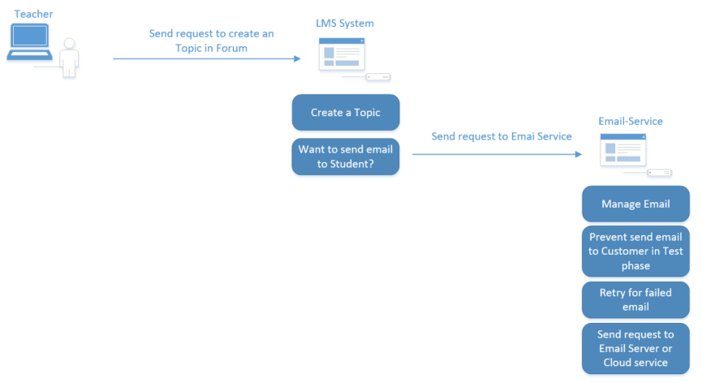
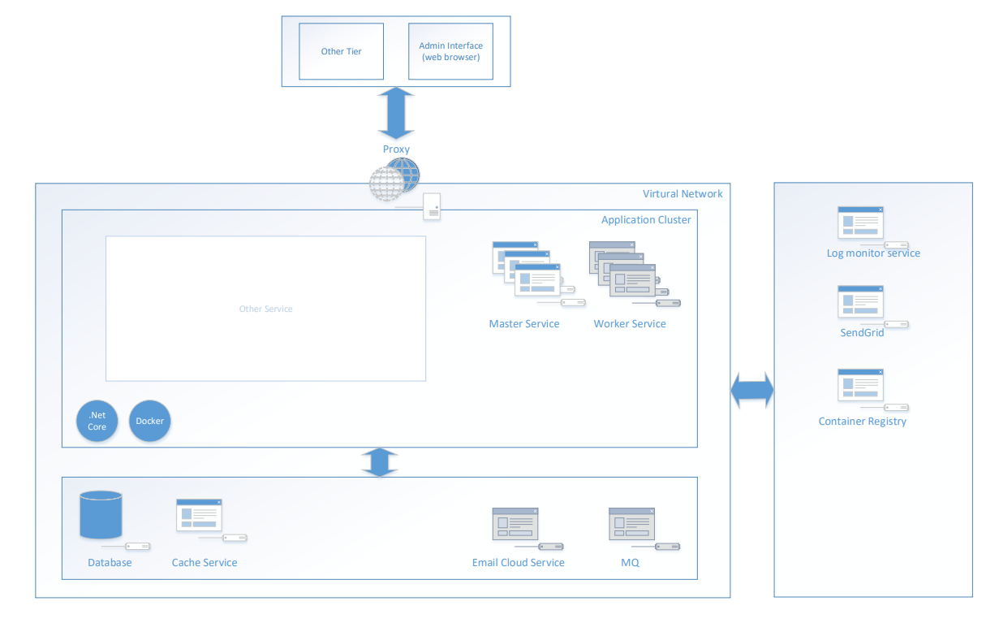

# Email-Service Design Document

## Table of Contents
1. Introduction
2. Overall Description
3. System Architecture and High-Level Design
4. Detailed System Design
5. Data Design
6. Interface Design
7. Security Design
8. Performance Design
9. Quality Attributes
10. Deployment Plan
11. Risk Analysis

## 1. Introduction
This document serves to provide an overview and description of our design for the email service system. Firstly, we will discuss an overview of the system, the overall architecture, and the high-level solutions designed for the system. Following that, the subsequent section will provide a more detailed description of the designs tailored for the features that the system offers to address the requirements outlined in the requirement document. Additionally, the technological solutions employed by the system will be elaborated upon. Furthermore, details such as data entities, interfaces provided for integration with other systems, etc., will also be outlined in this document.

## 2. Overall Description
Our Email-Service is a system will handle request from other service. We have 2 keys funtion:
- Send Email: Receive a Email from "Users" then send a request to a Service (SendGrid, Smtp Server, Azure Service, AWS Service, etc. )
- Manage email: Manage the logic and the status of Emails which send to our service

Our "Users" is other project/product in our company. When they want to send an email to customer, they will use our SDK (we need to provide a SDK) to send a request to Email-Service. In Dev env, we will use only one service for all project/product and in Customer env, the project need to deploy our email service with their system.

## 3. System Architecture and High-Level Design
### A. Architectural Diagrams
The system architecture will depend on where the system is deployed. In the development environment, we can deploy a system shared across projects, while in specific projects, we may need to integrate our application into an existing architecture. However, we can provide a general overview of our system with the diagram below. Objects shaded in gray will be reviewed to provide support in the subsequent phases

### B. High-Level Component Overview
This part will provide a brief description of the high-level designs. Our services will be implemented by using .NET Core, and these services will be packaged into images and managed in a Container Registry. During system deployment, we can launch our containers within the application cluster.

In the initial phase of the project, the core part of our system will reside within the application cluster. Within this cluster, instances of the web API (Master service) will handle requests from other services within the cluster or externally, using an authentication method to identify the service user. Subsequently, all logic will be processed within the Master Service, including sending requests to SendGrid, managing emails, storing information in the database, and utilizing a cache service. The system will also feature logging functionality to record events, and we can collect this information using a log monitoring service (Elastic, Grafana, etc.), depending on the deployment system.

In the subsequent phases, we may consider incorporating additional instances of worker services and a message queue. This allows us to distribute certain tasks to workers through event messages, enhancing the system's availability and scalability.
## 4. Detailed System Design
### A. Master Service (our web api service)
#### In the first phase, our Master service will provide 2 API, Other service will use our Email-Service SDK to send request to Master service:
- SendEmailAsync API:
    * We will use rest API, and the input parameter will be the infomation needed to send email. It can be called email message, we need some properties (we need to discuss with project lead again to make sure about the API contract): From (string), To (List of string), Subject (string?), Body (string), CC (nullable list of string), Extention Properties, Resource id (guid?), Tid (guid?) 
    * Logic in that API: We will save a record to our database about Email information then return the email id (id of that record), Can check our Email sending strategies (blacklist/whitelist) to save with right status
    * We will have some background services, It will read the record in db then will hanlde the logic to send email, update status in our database, retry for failed email. To make sure the consistent when process data, we can only read the committed data in this service
    * The response of api will be an object include the id of email record
    * Authentication: We will authenticate user by an IDS (Already exist in our currents project), we can config the authentication scheme by the option in configuration file
- SendEmailsAsync API: (Maybe we can support to send emails in batch with a limitation?)
- GetEmailStatusAsync API:
    * We will provide an API for Admin portal or "User" to query the data in database for rewiew Email state. We can implement it base on requirement after discuss with Projects. (Maybe can use Tenant id, Resource id and Email Id to query the Email.?)

#### In the next phase we can change the logic to send event message to MQ and worker service can handle the logic.

### B. Worker Service
In the next phase, we can consider about implement this service. This Service will be used to handle the event message from Master service
### C. Email-Service SDK
- Use http client to send request to a REST api Enpoint in Email-Serivce, http client need be config the handler follow performance, security requirement
- Use token which received from IDS then add the token in header of request
- Use the contract class to send input parameter in request and read the response
### D. Storage server
- We will have an RDBMS server to store our data about Email, can configable follow "User" storage server, our code need support for many type of DB Server (SQL Server, PostgreSQL, MySQL, etc.)
- We will have a cache service to store some cache key-value data, can configable follow "User" storage server, our code need support for many type of cache service (Redis, memory, etc.)
### E. Email client service
- Our Email-Service will use a client to send request to a Server or use a service (Email client service), to send email to the receiver
- Our We should support multiple type of email client service. It will configable from env variable. The code logic can read the config of type and credentials of email client service then send the request.
- In the first phase we can only support for SendGrid. But our code support multiple type, like AWS service, Azure service, Custom smtp server, etc
### F. Message queue
In the next phase, we can use this service to implement the event driven pattern
### G. Log Monitor
- In our service, we use logger service of .Net and log provider of Nlog to write the log to the base directory of service.
- When deploy the email service, "User" can collect that logs by their way, then send the log to their Log Monitor system
- We may provide a timer job to remove old log in base directory of service every weeks/months
## 5. Data Design
We need discuss about the attachment part, after that we can provide a Diagram for our entity in database.
### Database Description
#### We have: Email table
##### Email Table 
- [Id] uniqueidentifier NOT NULL
- [Subject] nvarchar(4000) NULL
- [Sender] nvarchar(500) NOT NULL
- [SenderName] nvarchar(4000) NULL
- [Status] int NOT NULL
- [RetryCount] int NOT NULL default 0
- [IsDeleted] bit NOT NULL default 0
- [Created] datetime2 NOT NULL
- [Modified] datetime2 NOT NULL
- [IsRetrying] bit NOT NULL default 0
- [NextRetryTime] datetime2 NUll
- [IsBodyHtml] bit NOT NULL default 0
- [Body] nvarchar(max) NULL
- [Attachment] nvarchar (max) NULL
- [To] nvarchar (max) NOT NUll
- [CC] nvarchar (max) NULL
- [Bcc] nvarchar (max) NULL
- PRIMARY KEY CLUSTERED ([Id])

## 6. Interface Design
### 6.1. External Interfaces
Update Later
### 6.2. Internal Interfaces
Update Later
## 7. Security Design
Update Later
## 8. Performance Design
Update Later
## 9. Quality Attributes
Update Later
## 10. Deployment Plan
- First step: Deploy the Email Service to our company virtual network then test in Dev/smoke env
- Second step: Prepare then deploy our service to smoke/QA env of some project
- After the first and second step, if we pass the test, we can consider to deploy it to UAT env
## 11. Risk Analysis
Update Later

## Appendices
Additional material that supplements the main content of the document.

## Glossary
Definitions for terms and acronyms used throughout the document.

